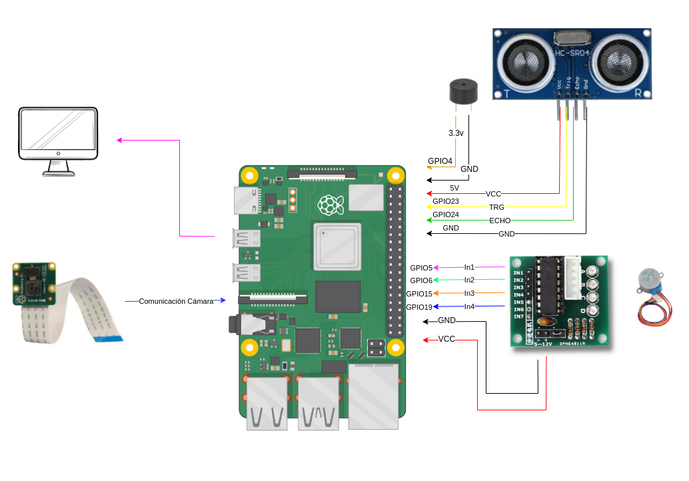

# Motor con sensor de proximidad

Este es un proyecto realizado por Jon Zorriketa y Adrián Caballero para la asignatura Análisis y Desarrollo de Estructuras de Software para SoPC (ADE) del máster SIEAV.

El objetivo de este proyecto es controlar un motor desde el teléfono móvil utilizando un sistema de servidor-cliente UDP. Además, al contar con un sensor de distancia, se ofrece cierto nivel de seguridad para ayudar a evitar riesgos. Esto se consigue ya que, si el sensor detecta algún elemento a una distancia considerada peligrosa, el motor se detiene. Dependiendo de la distancia a la que se detecta el obstáculo, el motor se puede volver a arrancar o no. En el caso en el que se considere demasiado peligroso que se vuelva a arrancar el motor, se da un aviso de manera sonora y se procede a sacar una foto de lo que se está detectando.


## Tabla de Contenidos

1. [Requisitos HW](#RequisitosHW)
2. [Software](#Software)
3. [Funcionamiento](#Funcionamiento)
4. [Uso](#Uso)


# Requisitos HW
Para poder realizar este proyecto se necesitan los siguientes componentes HW:
- Motor
    - IN1: GPIO 5
    - IN2: GPIO 6
    - IN3: GPIO 13
    - IN4: GPIO 19
- Driver motor
    - TRIG: GPIO 23
    - ECHO: GPIO 24
- Zumbador
    - Buzzer: GPIO 4
- Cámara
# Esquemático de Conexión HW





# Software

El programa se encuentra en la carpeta codigo y consta de diferentes funciones:
- Setup(): Esta función configura (indica si son de entrada o de salida) e inicializa los GPIO.
- set_step(int a, int b, int c, int d): Escribe el valor de las variables a, b, c y d a los GPIOs asignados para el motor.
- motor_control(): Función encargada de gestionar la acción del motor. Comprueba dos flags: keep_running y manual_override.
- sensor_monitor(): Función que obtiene la distancia medida por el sensor, y en función de la distancia a la que se mide el objeto, para el motor o no.
- main(): Función que gestiona el servidor UDP y las acciones del motor en función de los comandos que se reciben desde el móvil.


# Funcionamiento

Como se ha comentado en el apartado de software, el programa consta de diferentes funciones y la interconexión entre estas es lo que permite un correcto funcionamiento del programa. El servidor UDP recibe lo que se envía de manera remota; si no es una entrada válida (al principio un start o stop), imprime un mensaje comunicando que el comando introducido no es válido. Si el comando introducido es un start, se arranca el motor. Si se detecta el comando stop, el motor se detiene.

El sensor de distancia está midiendo la distancia en todo momento. Estas distancias son las que se comprueban y, en función de estas mediciones, se para el motor o se deja que continúe funcionando.
- Si el sensor de distancia detecta un elemento entre 80 y 40 cm mientras el motor está en funcionamiento, el motor se detiene y se imprime el siguiente mensaje (poner el mensaje concreto que ahora mismo no se recuerda). Si se manda el comando yes, el motor vuelve a funcionar; mientras que si se manda el comando no, el motor sigue parado.

- Si el sensor de distancia detecta un elemento a menos de 40 cm mientras el motor está en funcionamiento, el motor se para de inmediato, imprime el siguiente mensaje (poner el mensaje) y se saca una foto para poder ver qué es lo que se ha detectado.

- Si el sensor de distancia detecta un elemento entre 80 y 40 cm mientras el motor no está en funcionamiento, se imprime un mensaje por pantalla indicando que se debe proceder con cuidado.

- Si el sensor de distancia detecta un elemento a menos de 40 cm mientras el motor no está en funcionamiento, se imprime un mensaje por pantalla indicando que no es posible arrancar el motor, ya que hay algo demasiado cerca.


# Uso
Si se está pensando en usar el código de este repositorio, los pasos a seguir para poder hacerlo de una manera adecuada son los siguientes:

- ## Obtención y compilación del código
    Para la obtención de este código, se debe crear una carpeta en el sistema local y clonar este repositorio en la carpeta. Una vez clonado el repositorio, se debe entrar en la carpeta creada 
    y compilar el siguiente código:
    ```sh
    gcc -o motor_sensor_solo_pwm_camara_solo.c
    
    ```


- ## Conexión con el móvil
    Para poder interactuar a través del móvil con el motor, es necesario conectar tanto la Raspberry Pi como el móvil a la misma red WIFI. Una vez que ambos estén en la misma red, se debe comprobar la IP de la Raspberry Pi. Para ello, se usa el comando ifconfig y se revisa la IP de la interfaz de red wlan0.
    
    Se debe descargar una aplicación llamada UDP server en el móvil. Esta aplicación actuará como cliente. Una vez instalada, se accede a la aplicación y se configura la IP remota con la que se desea comunicar (esta IP es la que se ve en la interfaz de red wlan0 de la Raspberry Pi) y los puertos (el puerto remoto tiene que ser 6000, el local el que se prefiera).

- ## Iniciar y ejecutar
    Una vez que la aplicación esté configurada, se debe iniciar y ejecutar el archivo compilado:
    ```sh
    sudo ./motor_sensor_solo_pwm_camara_solo
    
    ```
    
    Ya debería estar recibiendo los mensajes desde el cliente del móvil.


